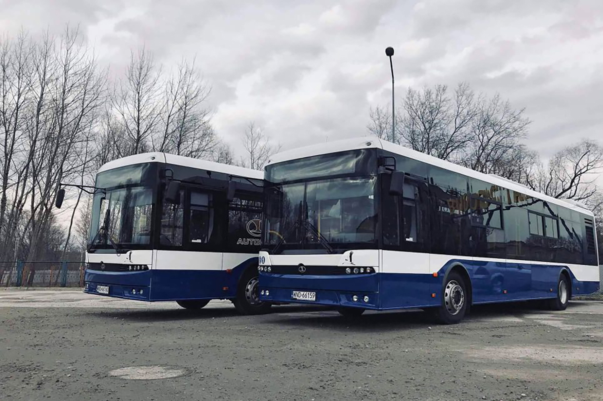

wfiohwfjwfwfoiwfwfwiofjwiofwiofwioejfoiwjfowejwejfwjoiwefw

wejfwejfioewjfokwepfokwpogkerwpokegkergw

lkwemfwejfiewfijweofkweoferognerieriogfjeroigfkerpogkerpokerpgk

| Bus | Tram | Train | Plane |
| --- | ---- | ----- | ----- |
|  50 | 30   | Praha | Riga  |
|  40 | 20   | Kyiv | Rome  |
|  30 | 10   | Lviv | Madrid  |

Table shows routes of the trasnsport. Nice trasport.

